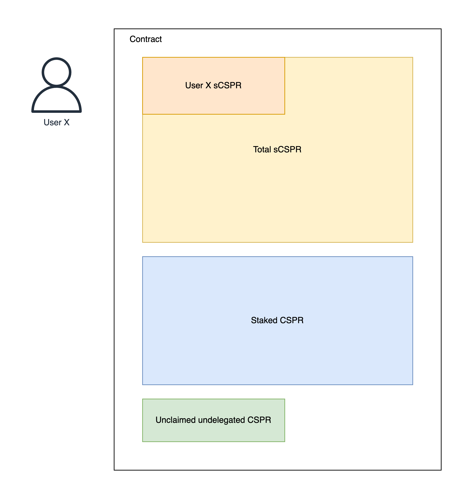

# 2024-11-06 - Contract scope review

## Participants

Maciej, Lorenzo, David, Ihor

## Agenda

Review the smart contracts for completeness and discuss the contract-level events.

## Discussion

During the meeting the participants raised the point that having the smart contracts should reflect the expected product intentions instead of expecting them. However, being in a situation where the initial version of smart contracts is ready w/o any written product requirements they agreed that it makes sense to review the existing assumptions in the smart contracts and, at the same, time prepare the MVP scope to be discussed on the next group meeting. Lorenzo will also prepare Figma mock-ups for the MVP version.

### Product assumptions

1. When undelegating `sCSPR` you need to wait for the underlying `CSPR` to be fully undelegated before claiming them back 
2. The only liquid `CSPR` held by contracts will be unclaimed unstaked `CSPR` (see [Example 1](#example-1-high-level-diagram))
3. Delegation and undelegation are percentage based (see [Example 2](#example-2-delegation))
4. `CSPR` and `sCSPR` will be at the 1-to-1 rate only at the launch (see [Example 3](#example-3-delegation))
5. New `sCSPR` are minted only during delegation. Similarly, they are burned only during undelegation  (see [Example 3](#example-3-delegation))
6. Rate between `sCSPR` and `CSPR` doesn't change when delegating or undelegating Only new staking rewards change the rate by increasing the amount of staked `CSPR`  (see [Example 3](#example-3-delegation))
7. The tokens are immediately delegated when delegating through the Liquid Staking Contract
8. Formula for liquid `CSPR` owned by a delegator is the following: `User X CSPR = User X sCSPR / Total sCSPR * Staked CSPR` (see [Example 1](#example-1-high-level-diagram))

#### Example 1 (High-level diagram)



#### Example 2 (Delegation)

```
Alice delegates 50 CSPR
Bob delegates 150 CSPR
...
Alice undelegates 50 sCSPR

As the result, Alice will receive 25% (50 / 200) of all staked CSPR  
```
#### Example 3 (Delegation)

```
Era 1
# Before sCSPR = 0 / CSPR = 0 / Rewards = 0 / Rate = 1
User Y stakes 1000 CSPR and receives 1000 sCSPR
# After sCSPR = 1000 / CSPR = 1000 / Rewards = 0 / Rate = 1

Era 2
# Before sCSPR = 1000 / CSPR = 1000 / Rewards = 0 / Rate = 1
User X stakes 10000 CSPR and receives 10000 sCSPR
# After sCSPR = 11000 / CSPR = 11000 / Rewards = 0 / Rate = 1

Era N
# Before sCSPR = 11000 / CSPR = 12000 / Rewards = 1000 / Rate = 11000/12000 = 0.9166
User Z stakes 20000 CSPR and receives 18332 sCSPR 
# Before sCSPR = 29332 / CSPR = 32000 / Rewards = 1000 / Rate = 29332/32000 = 0.9166
```

#### Example 4 (Undelegation)

```
Era N
Before sCSPR = 11000 / CSPR = 12000 / Rewards = 1000 / Rate = 0.916

User X sCSPR = 10000
User X CSPR = 10000 / 11000 * 12000 = 10909.09 (calculated)

User X stakes 10000 sCSPR

User X sCSPR = 0
User "unstaking" CSPR = 10909.09 (stored in the contract)

After sCSPR = 1000 / CSPR = 1090.91 / Rewards = 1000 / Rate = 0.916

Era N + 7

The auction contract sends 10909.09 CSPR to the Staked CSPR contract (automatically)
User X claims "available unstaked" CSPR
```

### Missing cases

1. The Liquid Staking has to handle situations when the validator becomes inactive or withdraws their bid 

### MVP scope

1. Users should be able to see (maybe indirectly) the current `sCSPR` / `CSPR` rate
2. Users should be able to stake `CSPR` and receive `sCSPR`
3. Users should be able to unstake `sCSPR` and receive receipts
4. Users should be able to claim unstaked `CSPR` (using receipts indirectly)
5. Users should be able to see their `CSPR` and `sCSPR` balances
6. Users should be able to see the total amount of staked `CSPR` (in the system)

## Action items

1. Lorenzo will provide Figma mock-ups for the MVP version
2. David will prepare technical requirements for the MVP version
